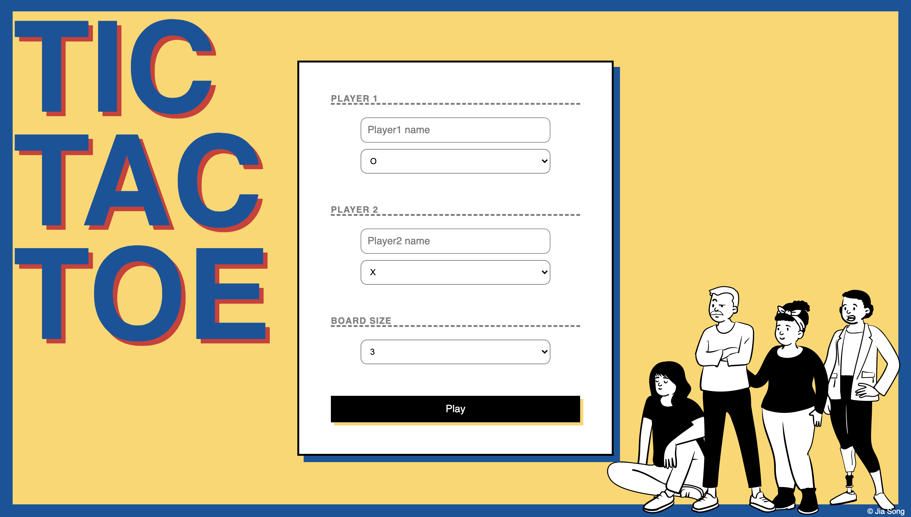
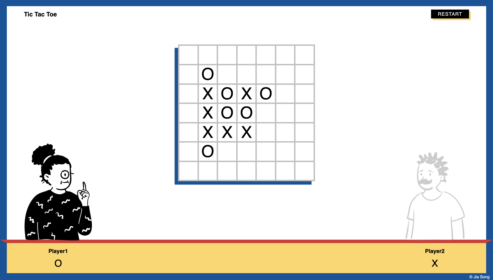
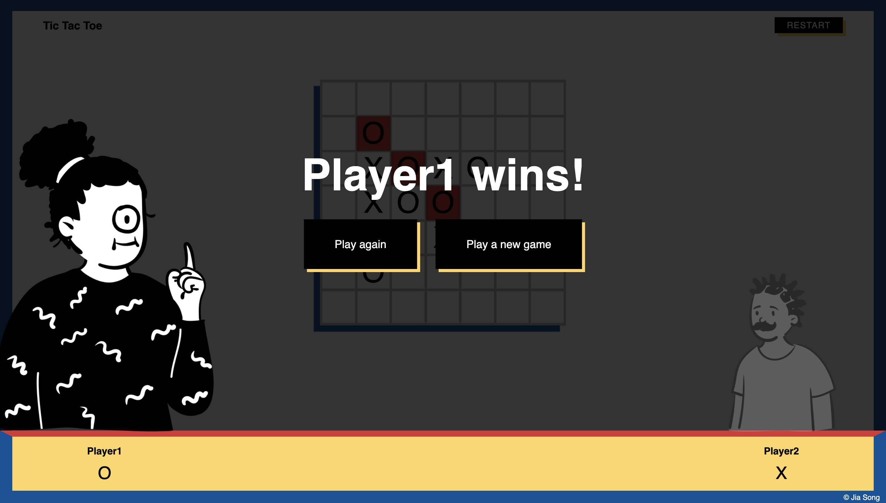

# Tic Tac Toe

A simple NxN Tic Tac Toe game. Play against a friend or an AI. This was built as part of GA project.

**[Click here to play in live.](https://jiasong214.github.io/tic-tac-toe/)**

## Features

- User can choose game type: single-player or multi-player
- User can choose their username and token.
- User can select the game board size.
- Lost connection or accidentally closed the tab? Don't worry! It'll remember your progress!
- Simple AI player

## Tech

- HTML/CSS
- Javascript
- jQuery

## Known issues

- [ ] AI doesn't work perfectly.

## Wishlist

- [ ] Add game sound.
- [ ] Make AI smarter.
- [ ] Improve winner finding algorithm.
- [ ] Visualize searching for a winner with cool animations.
- [ ] Add a dark mode option/theme option.

## Screenshot

